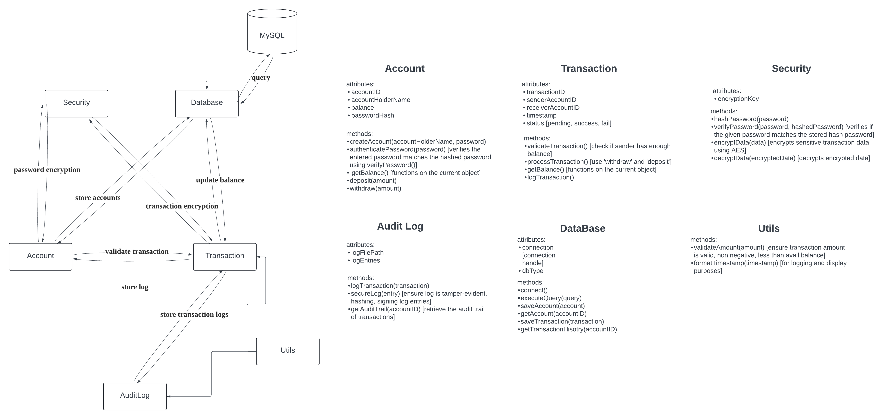

# CastleKeep: secure banking transaction
created by Seung Whan Song

## Introduction
The purpose of this project is to demonstrate my skills on C++ (OOP), Secuirty (OpenSSL/Hashing), SOLID, interacting with DB and Testing (Google Test) by creating a simple backend for what could be a bank (CastleKeep Bank). With this project you can add accounts, and transact money between accounts (deposite, withdraw). The project also aims to upload basic security like an actual bank through password hashing and encrypting transaction data with OpenSSL.

Here is a basic flowchart of what the different classes do

## Compiler Set up/Compile
Set up Complier following this doc: [doc](https://code.visualstudio.com/docs/languages/cpp)

compile using: `g++ -I include -I"C:/Program Files/OpenSSL-Win64/include" -L"C:/Program Files/OpenSSL-Win64/lib" -o bin/main src/main.cpp src/Account.cpp src/Transaction.cpp src/Database.cpp src/Security.cpp src/AuditLog.cpp -lssl -lcrypto`

run using: `bin\main`

### Compile tests
Compiling tests: `g++ -Iinclude -IC:/OpenSSL-Win64/include -L"C:/OpenSSL-Win64/lib" src/Account.cpp src/Security.cpp tests/test_Account.cpp -lssl -lcrypto -o bin/test_account`

run using: `bin\test_account`

## OpenSSL
1. manually download OpenSSL library on windows [link](https://slproweb.com/products/Win32OpenSSL.html)
2. download the `msi` version
3. Check that the path to bin has been set in the system environment variables `PATH` (the bin folder)
4. Double check with `openssl version` in the terminal

## Google test
clone googletest into the root directory from this [repo](https://github.com/google/googletest.git)

## CMAKE
from CMAKE install windows x84 .msi [link](https://cmake.org/download/)

double check that the PATH has been set up in System Variables typically the path is `C:\Program Files\CMake\bin` (should contain the cmake.exe)

go to settings -> search "cmake path" -> Workspace -> set "Cmake:cmake path" as `C:\Program Files\CMake\bin\cmake.exe`

in the command palette (ctrl + shift + p) -> Reload Window -> inm the command palette again -> CMAKE: Select kit ->F7 (build)

To run test go to command palette again -> CMake:Run Test (next time you can just click the "Run CTest" button at the bottom of the terminal)

## Data Base
Download [PostgreSQL](https://www.enterprisedb.com/downloads/postgres-postgresql-downloads), [PopSQL](https://popsql.com/download)

make sure to download `pgadmin` during installation.

PostgreSQL Password: `postgresql!`

add `C:\Program Files\PostgreSQL\17\bin` to system variables path.

In the command prompt: `psql -U postgres`

`CREATE DATABASE new_database_name;`

List databases `\l`

`\conninfo` to know about current connecion informaiton (database connection, user etc ...)

`\c castle` to swtich to castle database 

`\dt` to list all tables in the database

`\d table_name` if i want to see the columns of the table

connect postgresql to popsql for easier manipulation 

In the vscode intellisense configurations >> include path >> `C:/Program Files/PostgreSQL/17/include` (or wherever libpq-fe.h exists)

## Resources
- [CMAKE resource](https://www.youtube.com/watch?v=4U-lnfxY2U0&ab_channel=LearnQtGuide)
- [Google Test Resource](https://www.youtube.com/watch?v=Lp1ifh9TuFI&ab_channel=Rhymu%27sVideos)
- [Google's C++ style guide](https://google.github.io/styleguide/cppguide.html#C++_Version)

## Short Cuts
- `ctrl + shift + p` to look for command palette
-  `shift + alt + f` formatting
- `ctrl + shift + v` check md format

